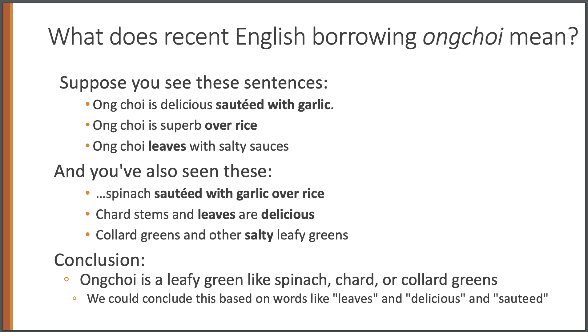
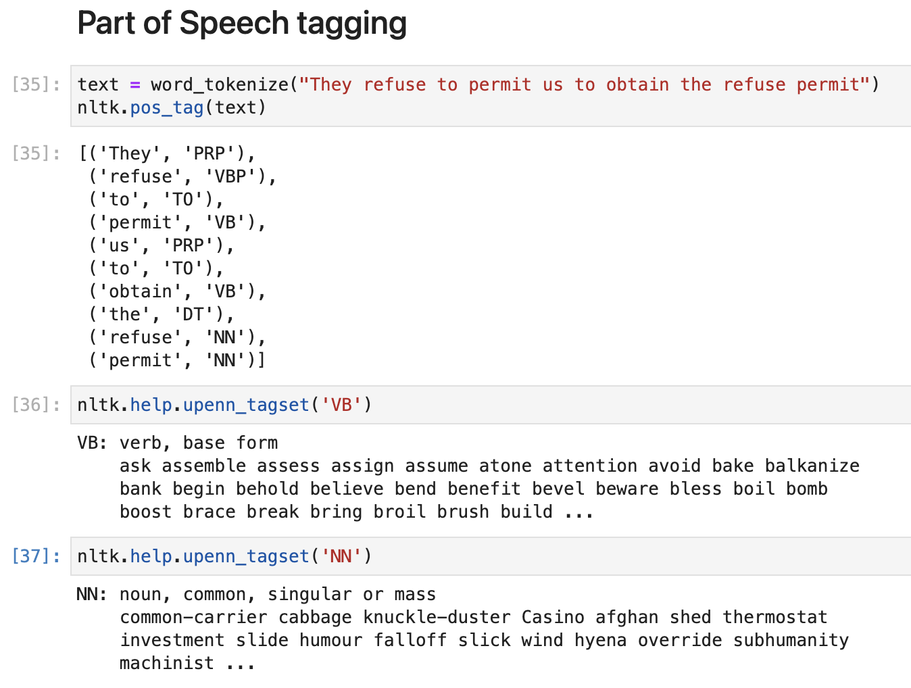
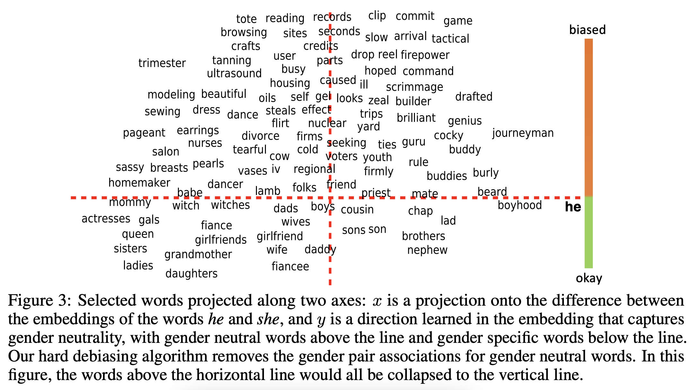

```{r setup, include=FALSE}
knitr::opts_chunk$set(echo = FALSE)
```

<style>
slides > slide { overflow: scroll; }
slides > slide:not(.nobackground):after {
  content: '';
}
</style>

## Syllabus

* Static word embeddings
    * Frequency based methods, word2vec, GloVe, fastText, evaluation of embeddings
* Contextual word embeddings
    * ELMo, **Transformers** and attention, BERT, sentence embeddings, contrastive learning
* Additional topics
    * Geometry of the embedding space, bias, sentiment, multilingual embeddings
* Topological data analysis
    * Hyperbolic embeddings, singularities and topological polysemy

## Motivation: Winograd schemas

* The trophy doesn’t fit into the brown suitcase because it’s too <span style="color: blue;">large</span>.
* The trophy doesn’t fit into the brown suitcase because it’s too <span style="color: blue;">small</span>.

*Task:* Co-reference resolution

## Motivation: Winograd schemas

* The city councilmen refused the demonstrators a permit because they <span style="color: blue;">feared</span> violence.
* The city councilmen refused the demonstrators a permit because they <span style="color: blue;">advocated</span> violence.

*Task:* Co-reference resolution

* easy for humans to solve
* difficult for computers
  * solution relies on real-world knowledge and common sense reasoning

## Motivation: Winograd schemas

* I put the cake away in the refrigerator. It has a lot of <span style="color: blue;">butter</span> in it.
* I put the cake away in the refrigerator. It has a lot of <span style="color: blue;">leftovers</span> in it.

  
## Motivation: Garden-path sentences

* The old man the boat.

---

* The complex houses married and single soldiers and their families.
* The horse raced past the barn fell.
  
## Methods

"You shall know a word by the company it keeps." (J. R. Firth, 1957)

<center>

{width=90%}

{width=90%}

[@jurafsky2009speech]
(https://web.stanford.edu/~jurafsky/slp3/)

</center>

---

<iframe src="text8_fasttext_2D_tSNE_1000_vectors_plotly.html"></iframe>

Some of the word vectors from a 100 dimensional fastText embedding trained
on a Wikipedia corpus; projected to 2 dimensions using t-SNE.

## Applications of word embeddings

* *Word-sense induction* (WSI) or *word-sense discrimination*: task is the identification of the senses/meanings of a word
* Output: clustering of contexts of the target word, or a clustering of words related to the target word

**Example:**

* target word “cold”
* collection of sentences:
  * “I caught a cold.”
  * “The weather is cold.”
  * "The ice cream is cold."
  
**Output:** ?
  
---
  
* *Word-sense disambiguation* (WSD): relies on a predefined sense inventory, and the task is to solve the ambiguity in the context
* Output: identifying which sense of a word is used in a sentence

<center>

{width=90%}

</center>

## Part-of-speech tagging

* grammatical tagging: decide which part of speech
(noun, verb, article, adjective, preposition, pronoun, adverb, conjunction, and interjection)
a word in a text corpus belongs to

<center>

{width=90%}

</center>

PoS might depend both on definition of the word and its context

* in language a large portion of word-forms are ambiguous
* example from Wikipedia:
  * "dogs" usually is a plural noun,
  * but can also be a verb as in the sentence
  "The sailor dogs the hatch."
  
* example where order matters:
  * "can of fish"
  * "we can fish"

---

Sub-categories for PoS tagging:

* for nouns, the plural, possessive, and singular forms can be distinguished.
* "case" (role as subject, object, etc.), grammatical gender, and so on
* verbs are marked for tense, aspect, and other things

Other tagging tasks:

<center>

{width=70%}

</center>

## Text classification

* Document classification: spam / not spam
* Review classification: positive / negative
* Sentiment: positive / neutral / negative

* single-label classification / multi-label classification

## Generative and Discriminative Models

* Generative models:
  * learn undelying data distribution
  $P(x, y) = P(x | y) \cdot P(y)$
  * prediction: given an input $x$, pick a class with the highest joint probability
  $y = \argmax_{k} P(x | y = k) \cdot P(y = k)$
    * maximum a posteriori (MAP) estimate
  
* Discriminative models:
  * learn the boundaries between classes (i.e. learn how to use the features)
  * prediction: given an input $x$, pick a class with the highest conditions
  probability $y = \argmax_{k} P(y = k | y)$
    * Maximum Likelihood Estimate (MLE) of parameters

TODO: How to do prediction

---

*Bag of Words (BoW) assumption*: word order does not matter

TODO

## Static word embeddings

TODO

## Frequency based methods

TODO

## word2vec, GloVe, fastText

word2vec:
[@DBLP:journals/corr/abs-1301-3781;@DBLP:journals/corr/MikolovSCCD13]

## Contextual word embeddings

* I'm going to the <span style="color: blue;">bank</span> to withdraw some money.
* We're sitting on the river <span style="color: blue;">bank</span> with some friends.

<center>

{width=90%}

</center>

## Recurrent methods: ELMo

<center>

{width=95%}

(https://jalammar.github.io/illustrated-bert/)

</center>

## **Transformers**

<center>

{width=40%}

[@DBLP:journals/corr/VaswaniSPUJGKP17]

{width=90%}

</center>

## Bidirectional Encoder Representations from Transformers (BERT)

<center>

{width=90%}

</center>

<center>

![[@DBLP:journals/corr/abs-1810-04805]](bert_schematic_comparison_original_article.png){width=95%}

</center>


## Huggingface transformers

<center>

{width=95%}

(https://huggingface.co/distilbert-base-uncased)

</center>

## Sentence embeddings

TODO

* Sentence-BERT
  * sentence-pair regression tasks like semantic textual similarity (STS)

## Geometry of the embedding space

TODO

## Bias

<center>

{width=70%}

[@DBLP:journals/corr/BolukbasiCZSK16a]

{width=90%}

</center>

## Sentiment

<center>

{width=60%}

(https://www.kaggle.com/datasets/lakshmi25npathi/imdb-dataset-of-50k-movie-reviews)

</center>

---

<center>

{width=50%}

{width=50%}

{width=75%}

[@yu-etal-2017-refining]

</center>

## Multilingual embeddings

<center>

{width=80%}

[@Luong-etal:naacl15:bivec], (https://nlp.stanford.edu/~lmthang/bivec/)

{width=90%}

[@DBLP:journals/corr/abs-1710-04087], (https://github.com/facebookresearch/MUSE)

</center>

## Hyperbolic embeddings

<center>

{width=70%}

[@DBLP:journals/corr/NickelK17]

</center>

* Poincaré GloVe [@DBLP:journals/corr/abs-1810-06546]

<center>

{width=75%}

Hyperbolic image embeddings [@DBLP:journals/corr/abs-1904-02239]

</center>

## Singularities and Topological Data Analysis (TDA)

* *manifold hypothesis* does not hold at all points of certain static word embeddings

<center>

{width=55%}

[@jakubowski2020topology]

</center>

* *topological polysemy*: count the number of "meanings" around a singularity

<center>

{width=90%}

</center>

# Thank you!

## Organisation

* Schedule: See [Google sheet](https://docs.google.com/spreadsheets/d/1s-pxSBL0pK5RN5ny5IiSsXUL9i8nQM7iIx_j_euDf08/edit?usp=sharing)
* Each week talks by students (1 or 2 speakers per session, 70 minutes in total)
  * there should be enough time for questions and a discussion
* Guest lecture ?
* The final grade is based on your presentation
* Hand in your extended abstract (ideally .tex, .bib files and compiled .pdf; **maximum** 2 pages with references) via ILIAS

## References
